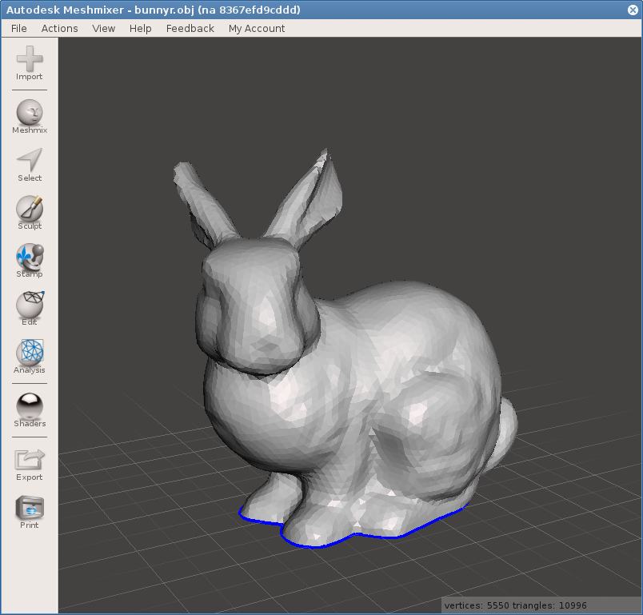

MeshMixer in Docker
===================

**This repository probably broken**, it was an experiment. Use AppImage instead:

How to create MeshMixer AppImage
--------------------------------

```bash
# Get a recent or old Ubuntu up and running, maybe use vagrant:
vagrant init ubuntu/xenial64
vagrant up
vagrant ssh

# On Ubuntu, create an AppImage of MeshMixer
sudo apt-get update
sudo apt-get install git wget dpkg-dev libfuse2 fuse desktop-file-utils
git clone https://github.com/probonopd/AppImages.git
cd AppImages/
chmod +x recipes/meta/Recipe
recipes/meta/Recipe recipes/meta/MeshMixer.yml
# or: recipes/meta/Recipe --no-di recipes/meta/MeshMixer.yml

# Get the AppImage from the vagrant box to host's PWD:
mv out/MeshMixer*AppImage /vagrant/
```

The resulting file can be just executed. Tested on Fedora 25 and it works fine.

About this repo
---------------

This is a simple repo with a Makefile that will create and run MeshMixer in Docker.

To build the docker image, simply run `make`, to run MeshMixer, run `make run`.

[MeshMixer for Linux](http://www.meshmixer.com/linux.html) is currently only available for Ubuntu 14.04,
so if you are using anything better, you can run MeshMixer in Docker.

Note that if your user UID and/or GID is different than 1000, you'll have to edit the Dockerfile.

When running, your home directory is mounted inside the container for your convenience. However, this might be dangerous.

Feel free to report any issue related to what this little project does on GitHub.
Please, report any issues with MeshMixer itself on [their forum](http://meshmixerforum.com/index.php?board=8.0).


